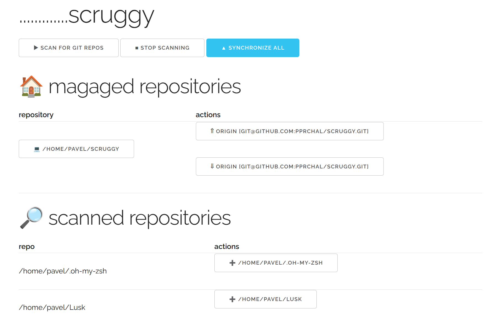

# scruggy

Dashboard for your git repositories

_Scruffy's git go tool._

* Organize your git repositories
* Scan your computer for repos
* Automate synchronization chain




1. Scans your PC for all .git repos
2. push/pull - synchronize all repos by single click
3. keep config simple - no sql, just single `config.ini`
```ini
[global]
scan = /home/pavel
period = 3d
port = 8080

[/home/pavel/scruggy]
actions=push-c,pull-d

[/home/pavel/Lusk]
actions=push-a,pull-a
```

## TODO's:
* license
* packaging

Pavel Prchal, 2025